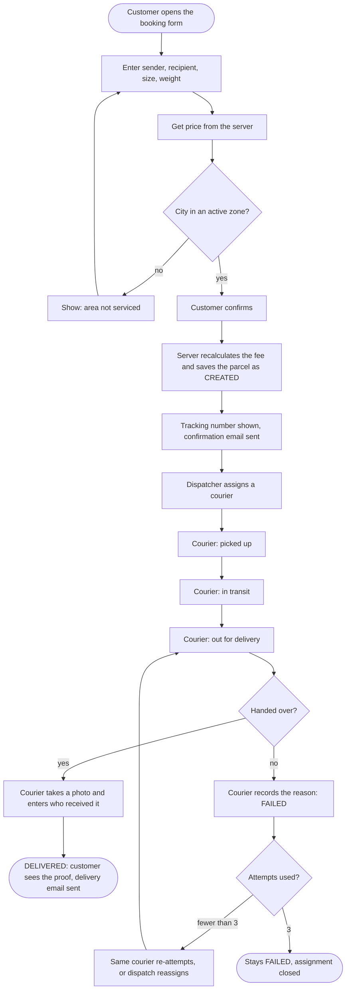
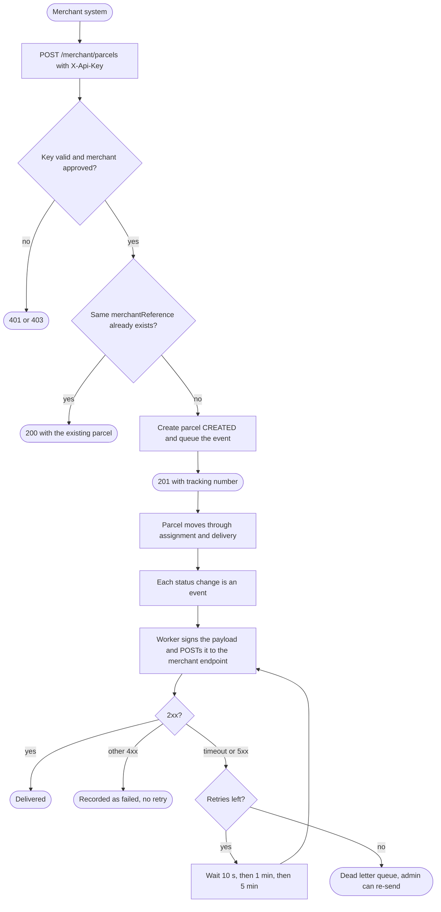
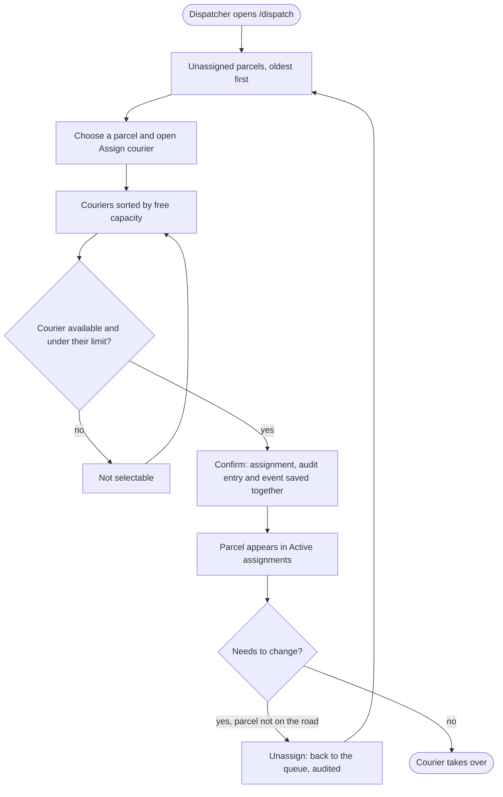
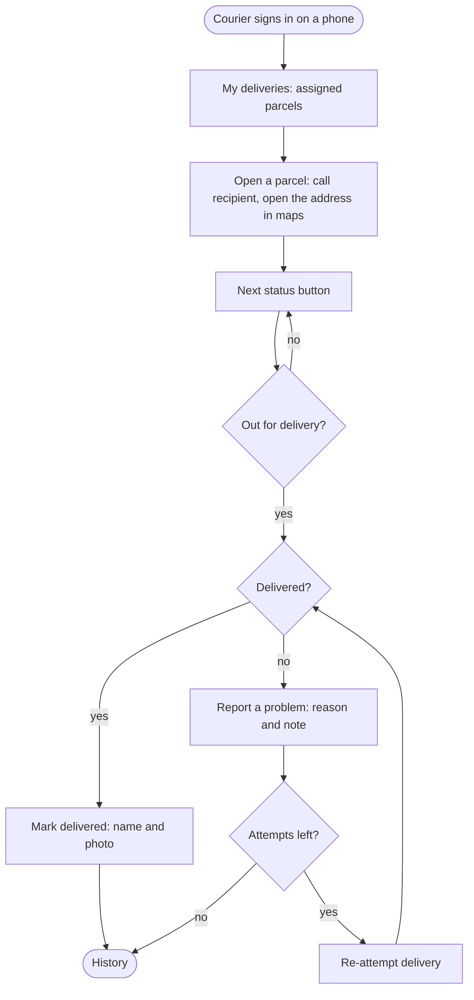

# Activity diagrams

## 1. Booking to delivery

```mermaid
flowchart TD
  A([Customer opens the booking form]) --> B[Enter sender, recipient, size, weight]
  B --> C[Get price from the server]
  C --> D{City in an active zone?}
  D -- no --> E[Show: area not serviced] --> B
  D -- yes --> F[Customer confirms]
  F --> G[Server recalculates the fee and saves the parcel as CREATED]
  G --> H[Tracking number shown, confirmation email sent]
  H --> I[Dispatcher assigns a courier]
  I --> J[Courier: picked up]
  J --> K[Courier: in transit]
  K --> L[Courier: out for delivery]
  L --> M{Handed over?}
  M -- yes --> N[Courier takes a photo and enters who received it]
  N --> O([DELIVERED: customer sees the proof, delivery email sent])
  M -- no --> P[Courier records the reason: FAILED]
  P --> Q{Attempts used?}
  Q -- fewer than 3 --> R[Same courier re-attempts, or dispatch reassigns] --> L
  Q -- 3 --> S([Stays FAILED, assignment closed])
```

## 2. Merchant order and webhook

```mermaid
flowchart TD
  A([Merchant system]) --> B[POST /merchant/parcels with X-Api-Key]
  B --> C{Key valid and merchant approved?}
  C -- no --> D([401 or 403])
  C -- yes --> E{Same merchantReference already exists?}
  E -- yes --> F([200 with the existing parcel])
  E -- no --> G[Create parcel CREATED and queue the event]
  G --> H([201 with tracking number])
  H --> I[Parcel moves through assignment and delivery]
  I --> J[Each status change is an event]
  J --> K[Worker signs the payload and POSTs it to the merchant endpoint]
  K --> L{2xx?}
  L -- yes --> M([Delivered])
  L -- other 4xx --> N([Recorded as failed, no retry])
  L -- timeout or 5xx --> O{Retries left?}
  O -- yes --> P[Wait 10 s, then 1 min, then 5 min] --> K
  O -- no --> Q([Dead letter queue, admin can re-send])
```

## 3. Dispatch

```mermaid
flowchart TD
  A([Dispatcher opens /dispatch]) --> B[Unassigned parcels, oldest first]
  B --> C[Choose a parcel and open Assign courier]
  C --> D[Couriers sorted by free capacity]
  D --> E{Courier available and under their limit?}
  E -- no --> F[Not selectable] --> D
  E -- yes --> G[Confirm: assignment, audit entry and event saved together]
  G --> H[Parcel appears in Active assignments]
  H --> I{Needs to change?}
  I -- yes, parcel not on the road --> J[Unassign: back to the queue, audited] --> B
  I -- no --> K([Courier takes over])
```

## 4. Courier day

```mermaid
flowchart TD
  A([Courier signs in on a phone]) --> B[My deliveries: assigned parcels]
  B --> C[Open a parcel: call recipient, open the address in maps]
  C --> D[Next status button]
  D --> E{Out for delivery?}
  E -- no --> D
  E -- yes --> F{Delivered?}
  F -- yes --> G[Mark delivered: name and photo] --> H([History])
  F -- no --> I[Report a problem: reason and note]
  I --> J{Attempts left?}
  J -- yes --> K[Re-attempt delivery] --> F
  J -- no --> H
```
